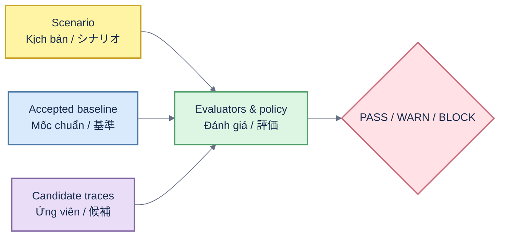

# RAGOps

[English](#english) · [Tiếng Việt](#tiếng-việt) · [日本語](#日本語)

Offline, reproducible release gates for RAG systems and AI agents.



## English

RAGOps compares recorded candidate behavior with an accepted baseline, applies a versioned release policy, and emits one canonical `PASS`, `WARN`, or `BLOCK` decision across JSON, Markdown, HTML, JUnit, SARIF, and GitHub Summary. The dependency-free core performs no network calls. Optional adapters import vendor exports; the API/workbench ships in the wheel through the `api` extra.

Requirements: Python 3.11+.

Current technical references: [architecture](docs/ARCHITECTURE.md), [contracts](docs/CONTRACTS.md), [governance](docs/governance.md), [operations](docs/OPERATIONS.md), [security](SECURITY.md), and [v2.0.1 release notes](docs/releases/v2.0.1.md).

The repository is also a skills-only plugin for ChatGPT, Codex, Claude Code and Cowork. It does not include a hosted MCP connector. See the [directory submission package](docs/submission/DIRECTORY_SUBMISSION.md), [privacy policy](PRIVACY.md), [terms](TERMS.md), and [support guidance](SUPPORT.md).

```bash
pip install ragops
ragops demo --profile engineer --output ./demo-output
ragops evidence verify --bundle ./demo-output/evidence
open ./demo-output/release-report.html
```

The credential-free demo intentionally returns `BLOCK`: citation coverage `1.0 -> 0.5`, citation precision `1.0 -> 0.5`, and lexical groundedness `1.0 -> 0.6`. It is synthetic benchmark evidence, not production adoption evidence.

Install `ragops[api]` and run `ragops serve` for the local authenticated API/workbench. Use `ragops adapter list` for Phoenix, Ragas, DeepEval, LangSmith, MLflow, Promptfoo, custom JSON, and installed entry-point adapters.

## Tiếng Việt

RAGOps so sánh trace ứng viên với baseline được chấp nhận, áp dụng release policy có version và xuất cùng một quyết định `PASS`, `WARN` hoặc `BLOCK` sang JSON/Markdown/HTML/JUnit/SARIF. Core không dependency, chạy offline; API/workbench là extra tùy chọn. Demo synthetic cố ý tạo `BLOCK`, không phải bằng chứng production adoption.

Yêu cầu: Python 3.11+. Dùng các lệnh ở phần English để cài đặt, kiểm tra scenario, lint và test.

## 日本語

RAGOps は記録済み候補を承認済みベースラインと比較し、バージョン管理された方針から一つの `PASS`・`WARN`・`BLOCK` 判定を JSON、Markdown、HTML、JUnit、SARIF に出力します。依存関係のない core はオフラインで動作し、API/workbench は任意の extra です。デモは synthetic evidence であり、本番導入実績ではありません。

必要環境は Python 3.11 以上です。セットアップ、lint、テストには English セクションのコマンドを使用してください。

Released under the [MIT License](LICENSE).
