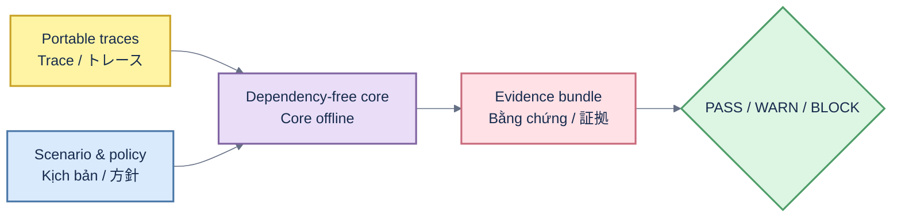

# RAGOps architecture / Kiến trúc / アーキテクチャ

## English

`src/ragops/` owns portable contracts, deterministic evaluators, slice/distribution analysis, policy decisions, calibration, evidence bundles, adapters, and SQLite governance. `src/ragops/api/` and `src/ragops/web/` are optional packaged adapters; importing the core never imports FastAPI, Uvicorn, or vendor SDKs. `apps/api/main.py` is a source compatibility shim. CLI/API/UI and CI renderers consume the same canonical decision evidence.

## Tiếng Việt

`src/ragops/` quản lý contract portable, evaluator xác định, policy, calibration, evidence bundle, adapter và SQLite governance. API/UI chỉ là adapter đóng gói tùy chọn; import core không import FastAPI/Uvicorn/vendor SDK. CLI/API/UI/CI dùng cùng canonical decision.

## 日本語

`src/ragops/` は portable contract、決定的 evaluator、policy、calibration、evidence bundle、adapter、SQLite governance を担当します。API/UI は任意の packaged adapter で、core import は FastAPI、Uvicorn、vendor SDK を読み込みません。CLI/API/UI/CI は同じ canonical decision を使用します。
